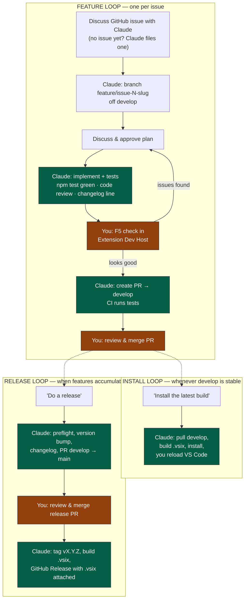

# Developer Guide — TimeScope

> Build, test, and release instructions for TimeScope.
> For runtime architecture and process diagrams see [docs/processes.md](docs/processes.md).
> For the project README see [README.md](README.md).

---


## Development Workflow

Development is conversational: you talk to Claude Code in VS Code, and Claude drives the mechanics. Three loops cover everything; each is encoded as a skill in [.claude/skills/](.claude/skills/) so Claude follows the same steps every time.



**Orange = your steps. Green = Claude's steps.** Your manual work per feature: discuss, approve the plan, F5-check, merge the PR.

### Branch model

| Branch | Purpose |
| :--- | :--- |
| `develop` | Integration branch — all feature PRs target this |
| `main` | Releases only — reached via release PRs from develop |
| `feature/issue-<N>-<slug>` | One per issue, off develop |
| Hotfix | Branch off `main`, PR → main, then merge main back into develop |

### The record of what happened

- **GitHub issue** — the problem and the discussion
- **PR description** — what changed and why (with a diagram when structure changed)
- **[CHANGELOG.md](CHANGELOG.md)** — one line per PR, becomes release notes automatically
- **[docs/processes.md](docs/processes.md)** — updated whenever architecture, state machine, or data formats change

---


## Building & Testing

```bash
npm install          # install dependencies
npm run compile      # compile TypeScript
npm test             # compile + run test suite (pure Node, no VS Code host)
npm run package      # build the .vsix (prepublish + vsce)
```

Press **F5** in VS Code to launch the Extension Development Host. It opens `test-workspace/`, whose settings pin TimeScope storage to `test-workspace/global-storage/` — F5 testing never touches your real tracking data.

### npm scripts

| Script | Purpose |
| :--- | :--- |
| `compile` | Compile TypeScript into `out/` |
| `watch` | Watch-mode recompile on file changes |
| `copy-dashboard` | Copy `src/dashboard/webview/*` → `out/dashboard/webview/` |
| `vscode:prepublish` | `compile` + `copy-dashboard` (used before packaging) |
| `test` | Compile then run the test suite (`out/test/run_tests.js`) |
| `package` | `vscode:prepublish` + `vsce package` → `timescope-<version>.vsix` |

### Data & migration utilities

Run directly (e.g. `npx ts-node scripts/<name>.ts`):

| Script | Purpose |
| :--- | :--- |
| `upgrade_log_to_v2.ts` | Migrate logs from v1 → v2 format (idempotent, creates backup) |
| `upgrade_jobs.ts` | Migrate legacy `jobs.json` to new `JobDTO` format |
| `validate_jobs.ts` | Validate `jobs.json` structure and report issues |
| `validate_upgraded.ts` | Validate that a log migration completed correctly |
| `repair_orphaned_sessions.ts` | Scan logs for orphaned sessions; interactive repair with markdown report |

---


## Continuous Integration

[.github/workflows/ci.yml](.github/workflows/ci.yml) runs `npm test` + `npm run vscode:prepublish` on every PR to `develop` or `main`, so every PR shows green checks before you merge.

---


## Project Structure

```text
src/
  extension.ts                  — activation, command registration, deactivation
  core/
    runtime.ts                  — Runtime class (single source of truth)
    event.ts                    — Event domain object (immutable)
    event_collection.ts         — EventCollection (immutable aggregate)
    event_dto.ts                — EventDTO (serialization boundary)
    event_repository.ts         — EventRepository (JSONL I/O, dedup, session queries)
    job.ts                      — Job domain object (immutable, FNV-1a ID)
    job_collection.ts           — JobCollection (immutable aggregate)
    job_dto.ts                  — JobDTO (serialization boundary)
    job_repository.ts           — JobRepository (JSON I/O, legacy detection)
    session.ts                  — Session (start→stop state machine)
    recovery.ts                 — Orphaned-session detection & recovery prompts
    timer.ts                    — Status bar timer helpers (pure functions)
    paths.ts                    — Path resolution & directory creation
  dashboard/
    controller/
      dashboard.ts              — Webview panel lifecycle & message handling
      dashboard_utils.ts        — Pure helpers (buildPayload, filterRelevantErrors)
    webview/
      index.html                — Dashboard HTML
      dashboard.js              — Dashboard client-side JS
  ui/
    pick_job.ts                 — Job QuickPick helper
  utils/
    fs_utils.ts                 — File-system helpers (ensureDir, readJSONL, readJSON)
  test/
    run_tests.ts                — Test runner entry point (all tests registered here)
    test_*.ts                   — Unit tests (plain functions that throw on failure)
out/                            — Compiled JS (packaged into .vsix)
scripts/                        — Data & migration utilities
docs/                           — Architecture & format specifications
test-workspace/                 — Workspace opened by F5 (isolated TimeScope storage)
.claude/skills/                 — feature / install / release workflow skills
```

---


## Related Documentation

| Document | Description |
| :--- | :--- |
| [README.md](README.md) | User-facing overview, commands, settings, data format |
| [CLAUDE.md](CLAUDE.md) | Project guide loaded by Claude Code each session |
| [CHANGELOG.md](CHANGELOG.md) | One line per PR; source of release notes |
| [docs/processes.md](docs/processes.md) | Runtime architecture, state machine, and Mermaid process diagrams |
| [docs/record_format_spec.md](docs/record_format_spec.md) | On-disk format for `jobs.json` and `logs.jsonl` |
| [docs/record_id_spec.md](docs/record_id_spec.md) | Deterministic record ID derivation (FNV-1a, base-36) |
| [coding_standards.md](coding_standards.md) | Project coding conventions |
