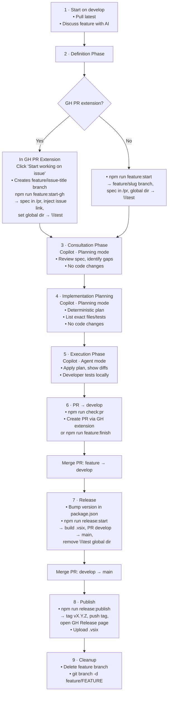

# Developer Guide — TimeScope

> Build, test, and release instructions for TimeScope.
> For runtime architecture and process diagrams see [docs/processes.md](docs/processes.md).
> For the project README see [README.md](README.md).

---

## Feature + Release Workflow

---

## Script Reference

Scripts are defined in `package.json`. Run with `npm run <name>`.

### Core Development

| Script | Purpose |
| :--- | :--- |
| `compile` | Compile TypeScript into `out/` |
| `watch` | Watch-mode recompile on file changes |
| `copy-dashboard` | Copy `src/dashboard/webview/*` → `out/dashboard/webview/` |
| `vscode:prepublish` | `compile` + `copy-dashboard` (used before packaging) |
| `test` | Compile then run the test suite (`out/test/run_tests.js`) |

### Feature Workflow

| Script | Purpose |
| :--- | :--- |
| `feature:start-gh` | Create spec in `/pr`, inject issue link, switch global dir → `\test` (no branch creation) |
| `feature:start` | Create `feature/<slug>` branch + spec in `/pr`, switch global dir → `\test` |
| `feature:finish` | Run PR readiness checks, open PR feature → develop |
| `check:pr` | PR readiness checks only (no PR creation) |

### Release Workflow

| Script | Purpose |
| :--- | :--- |
| `release:start` | Verify version bump, build `.vsix`, open PR develop → main |
| `release:publish` | Tag `vX.Y.Z`, push tag, open GitHub Release page |
| `check:release` | Release readiness checks only |

### Developer Utility Scripts

Scripts under `scripts/` are run directly (e.g. `npx ts-node scripts/<name>.ts`):

| Script | Purpose |
| :--- | :--- |
| `upgrade_log_to_v2.ts` | Migrate logs from v1 → v2 format (idempotent, creates backup) |
| `upgrade_jobs.ts` | Migrate legacy `jobs.json` to new `JobDTO` format |
| `validate_jobs.ts` | Validate `jobs.json` structure and report issues |
| `validate_upgraded.ts` | Validate that a log migration completed correctly |
| `repair_orphaned_sessions.ts` | Scan logs for orphaned sessions; interactive repair with markdown report |

---

## Building & Testing

`ash
npm install          # install dependencies
npm run compile      # compile TypeScript
npm test             # compile + run test suite
`

Press **F5** in VS Code to launch the Extension Development Host.

---

## Project Structure

`
src/
  extension.ts                  — activation, command registration, deactivation
  core/
    runtime.ts                  — Runtime class (single source of truth)
    event.ts                    — Event domain object (immutable)
    event_collection.ts         — EventCollection (immutable aggregate)
    event_dto.ts                — EventDTO (serialization boundary)
    event_repository.ts         — EventRepository (JSONL I/O, dedup, session queries)
    job.ts                      — Job domain object (immutable, FNV-1a ID)
    job_collection.ts           — JobCollection (immutable aggregate)
    job_dto.ts                  — JobDTO (serialization boundary)
    job_repository.ts           — JobRepository (JSON I/O, legacy detection)
    session.ts                  — Session (start→stop state machine)
    recovery.ts                 — Orphaned-session detection & recovery prompts
    timer.ts                    — Status bar timer helpers (pure functions)
    paths.ts                    — Path resolution & directory creation
  dashboard/
    controller/
      dashboard.ts              — Webview panel lifecycle & message handling
      dashboard_utils.ts        — Pure helpers (buildPayload, filterRelevantErrors)
    webview/
      index.html                — Dashboard HTML
      dashboard.js              — Dashboard client-side JS
  ui/
    pick_job.ts                 — Job QuickPick helper
  utils/
    fs_utils.ts                 — File-system helpers (ensureDir, readJSONL, readJSON)
  test/
    run_tests.ts                — Test runner entry point
    test_event.ts               — Event unit tests
    test_event_collection.ts    — EventCollection tests
    test_event_collection_extended.ts — Extended collection tests
    test_event_repository.ts    — EventRepository tests
    test_job.ts                 — Job unit tests
    test_job_collection.ts      — JobCollection tests
    test_jobs.ts                — Legacy job compat tests
    test_session.ts             — Session unit tests
    test_dashboard.ts           — Dashboard controller tests
out/                            — Compiled JS (packaged into .vsix)
pr/                             — Feature specifications
scripts/                        — Workflow automation & migration scripts
docs/                           — Architecture & format specifications
`

---

## Related Documentation

| Document | Description |
| :--- | :--- |
| [README.md](README.md) | User-facing overview, commands, settings, data format |
| [docs/processes.md](docs/processes.md) | Runtime architecture, state machine, and Mermaid process diagrams |
| [docs/record_format_spec.md](docs/record_format_spec.md) | On-disk format for `jobs.json` and `logs.jsonl` |
| [docs/record_id_spec.md](docs/record_id_spec.md) | Deterministic record ID derivation (FNV-1a, base-36) |
| [coding_standards.md](coding_standards.md) | Project coding conventions |
