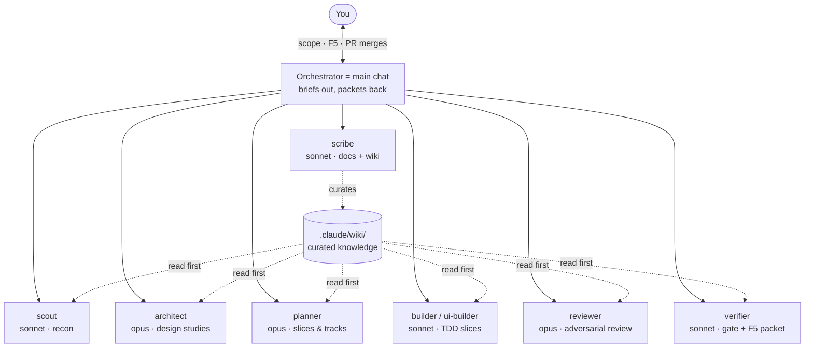

# TimeScope Agent Process

> The human-readable reminder of how development runs here: one orchestrator chat, eight
> project agents, three delegation tiers. The operational playbook agents follow is the
> [`delegate` skill](../.claude/skills/delegate/SKILL.md); the portable version for seeding
> other repos is [agent-process-foundation.md](agent-process-foundation.md).

## The shape

The main chat is the **orchestrator** — it holds decisions, user gates (scope, F5, PR
merges), and briefs/packets. Everything verbose runs in project agents that return
conclusions, never transcripts.

**Models by judgment density:** opus only where mistakes are expensive to unwind (architect,
planner — effort high; reviewer — medium); sonnet carries the token bulk (scout, builders
medium; verifier, scribe low). The orchestrator itself runs on opus — after delegation it is
the lowest-volume, highest-judgment context in the system.

## The tiers

| Tier | When | Flow |
| :--- | :--- | :--- |
| 0 — inline | single-file/trivial | no agents |
| 1 — standard | one coherent slice | scout explores → build (inline or one builder) → reviewer + verifier gate → scribe documents |
| 2 — wave | ≥2 disjoint-file tracks | planner partitions → parallel builders in worktrees → sub-branch PRs into the feature branch → verifier gates the assembled branch |

## A Tier 2 wave, end to end

Sub-branches are `feature/issue-<N>-<slug>--<track>` (labeled `track`); you never open the
worktrees. You touch three points: scope, one F5 on the assembled branch, the final PR.

## Who writes what you read

Builders draft per-slice F5 notes → **verifier** assembles the single F5 packet and leaves
the checkout F5-ready (fixtures staged, suites green) → the **orchestrator** delivers it with
the bold mission header. Scribe drafts dev-log/CHANGELOG/PR bodies for orchestrator edit, and
curates the wiki at PR time (what did this branch learn? prune to budget, lint the index).

## Never delegated

Scope agreement · F5 verification · PR merges · `package.json` changes · version bumps.
