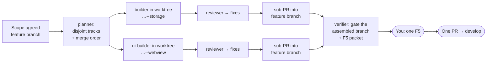
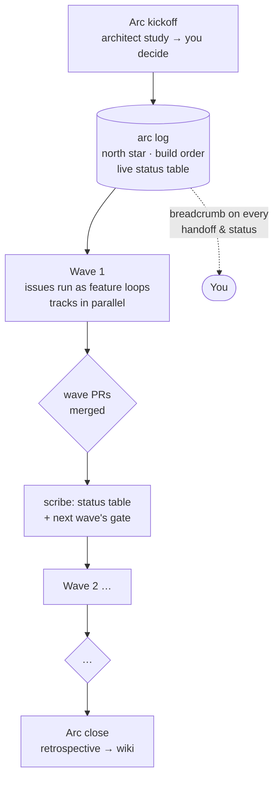
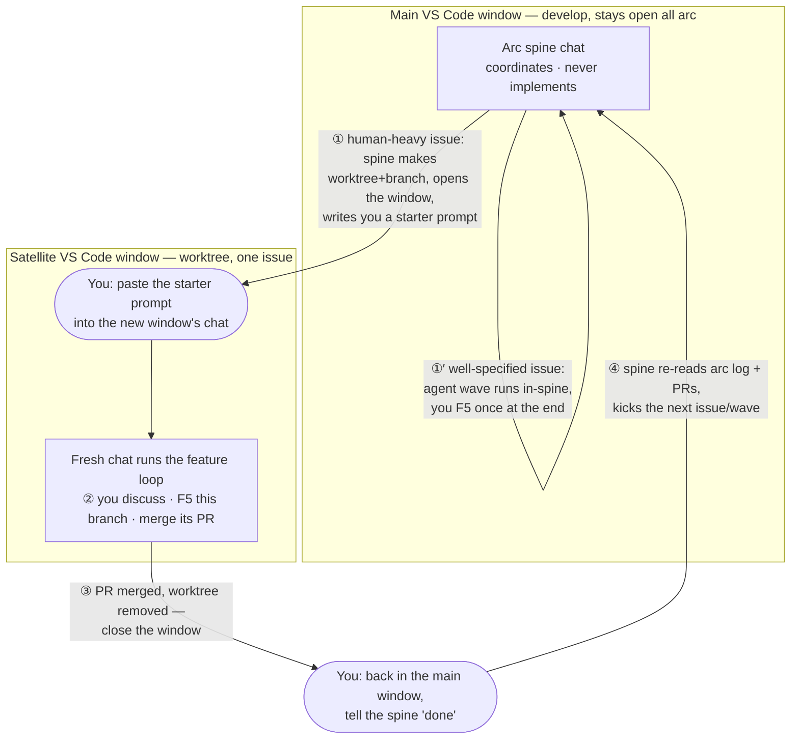

# TimeScope Agent Process

> The human-readable reminder of how development runs here: one orchestrator chat, eight
> project agents, three delegation tiers. The operational playbook agents follow is the
> [`delegate` skill](../.claude/skills/delegate/SKILL.md); the portable version for seeding
> other repos is [agent-process-foundation.md](agent-process-foundation.md).

## The shape

The main chat is the **orchestrator** — it holds decisions, user gates (scope, F5, PR
merges), and briefs/packets. Everything verbose runs in project agents that return
conclusions, never transcripts.

**Models by judgment density:** opus only where mistakes are expensive to unwind (architect,
planner — effort high; reviewer — medium); sonnet carries the token bulk (scout, builders
medium; verifier, scribe low). The orchestrator itself runs on opus — after delegation it is
the lowest-volume, highest-judgment context in the system.

## The tiers

| Tier | When | Flow |
| :--- | :--- | :--- |
| 0 — inline | single-file/trivial | no agents |
| 1 — standard | one coherent slice | scout explores → build (inline or one builder) → reviewer + verifier gate → scribe documents |
| 2 — wave | ≥2 disjoint-file tracks | planner partitions → parallel builders in worktrees → sub-branch PRs into the feature branch → verifier gates the assembled branch |

## A Tier 2 wave, end to end

Sub-branches are `feature/issue-<N><letter>--<slug>` (letter = merge order, e.g.
`feature/issue-47a--multi-instance`, labeled `track`) — the letter sits next to the issue
number so truncated branch lists stay readable, and the letterless branch is always the core
feature branch. You never open the worktrees. You touch three points: scope, one F5 on the
assembled branch, the final PR.

## An arc, end to end (multi-issue efforts)

An arc (like local-first storage: local-first → multi-instance → hierarchical jobs) is waves
of feature loops under one spine — the arc log. The orchestrator's job is to keep you
oriented: **every status update and F5 handoff during an arc opens with the breadcrumb**
`Arc <slug> — wave X/Y — issue #N (<track>)`, so you always know where in the forest you are.

The rhythm per wave: planner partitions the wave's issues into tracks (the arc log names the
highest-collision files and which track owns them) → feature loops run, possibly Tier 2 →
each PR updates the arc status table via scribe → the next wave starts only when this wave's
PRs are merged. Getting lost mid-arc should never require re-reading PRs — the arc log's
status table plus the breadcrumb is the recovery path.

### Spine & satellite windows

During an arc your **main window stays on `develop` with the arc spine chat** — it
coordinates and decides but never implements (no source edits, no feature branch; its state
is the arc log, so even a brand-new chat rehydrates in one read). Per issue, the spine picks
one of two dispatch targets:

The diagram below is **your** experience — which window you're in and what you do at each
handoff:

- **Human-heavy issue** (design iteration, UX feel, repeated F5) → satellite window: the
  spine creates the worktree + branch, opens the window, and hands you a one-line starter
  prompt to paste — one paste is the whole handoff cost, since a new window's chat starts
  cold. You and that chat pair on the issue with full attention; F5 runs against that
  window's own branch.
- **Well-specified issue** → in-spine agent wave: no new window; you F5 once at the end.

When a satellite's PR merges, you return to the spine and say "done" — it re-reads the arc
log and PR state (never another chat's memory) and kicks off the next issue or wave.

## Who writes what you read

Builders draft per-slice F5 notes → **verifier** assembles the single F5 packet and leaves
the checkout F5-ready (fixtures staged, suites green) → the **orchestrator** delivers it with
the bold mission header. Scribe drafts dev-log/CHANGELOG/PR bodies for orchestrator edit, and
curates the wiki at PR time (what did this branch learn? prune to budget, lint the index).

## Guardrails (enforced, not advisory)

The process above used to rely on a cold chat voluntarily following the skills. It didn't —
a satellite once ran its whole feature loop inline on Fable at high effort, skipped scope
agreement, and handed off an unstaged test environment. So the load-bearing rules are now
mechanical, via `.claude/settings.json` (a project `model: opus` default) and three hooks in
`.claude/hooks/` (portable Node, fail-open):

| Guardrail | Mechanism | Catches |
| :--- | :--- | :--- |
| **Model tier** | `model: opus` default + `SessionStart` hook that flags a Fable/non-opus main window and casts the chat's role | Orchestration burning top-tier budget; forgetting `/model opus` |
| **No feature work on develop/main** | `PreToolUse` hook denies Edit/Write to `src/`, `tests/`, `package.json` on `develop`/`main` (docs + `.claude/` stay writable for the spine) | Editing source on the wrong branch |
| **F5 env actually staged** | `Stop` hook blocks any F5 handoff without a fresh `.claude/.f5-ready.json` receipt (written by `f5_receipt.js` after the verifier stages fixtures) | Handing off a broken/empty test environment |

The model pin is read at session start, so it only applies to **newly opened / restarted**
windows — an already-running window must switch with `/model opus`. Hooks fail open: a bug in
one never bricks a session, it just stops enforcing.

## Never delegated

Scope agreement · F5 verification · PR merges · `package.json` changes · version bumps.
