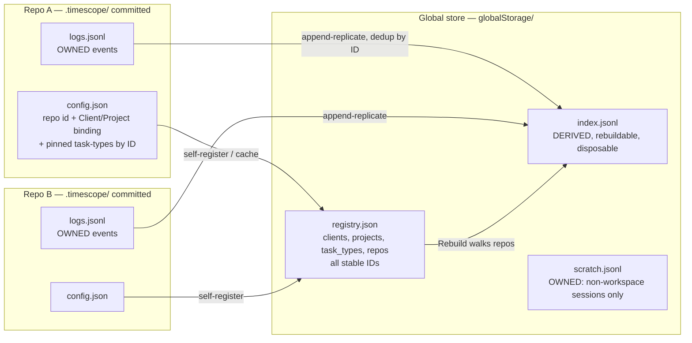

# Arc: Local-First Storage

> **Arc log**, not a spec. The *spine* above the per-issue [dev-logs](../dev-log/) — it holds
> the decisions and structure that span multiple issues. Each issue keeps its own dev-log for
> its own *why*; this file is the shared north star and the live map of the effort.
> *(An "arc" both spans multiple issues and is short for architecture — which is what these
> efforts usually are.)*

**Milestone:** [focus](https://github.com/Heliman84/timescope/milestone/1)  ·  **Architecture issue:** [#48](https://github.com/Heliman84/timescope/issues/48)  ·  **Started:** 2026-07-17

## Why this arc exists

The original storage model was **two coequal writable stores** (global `logs.jsonl` + workspace
`.timescope/logs.jsonl`, dual writes, merge/dedup) with no single owner for any event. That one
choice was the root cause behind most of the focus milestone: #47 (multi-instance corruption),
#2 (speculative folder creation), #3 (source confusion), #6 (local jobs question). Rather than
patch each symptom, we re-architect to **local-first**, which dissolves them.

Two user-critical outcomes drive the sequence: **(1)** multiple VS Code windows working in
parallel without interference, **(2)** hierarchical jobs — Client → Project → Task-type
(e.g. Lantern → firmware → EE CAD).

## Target architecture — one owner per event; global is derived

## Load-bearing decisions

- **One owner per event.** A repo's committed `.timescope/logs.jsonl` is authoritative for its
  events; the global `index.jsonl` is a rebuildable cache, never a second source of truth.
- **Repo is the authority about itself.** `config.json` (committed) carries repo id, Client/
  Project binding, and pinned task-types — clone on a new machine → self-registers. The registry
  caches what repos declare.
- **Timers are independent per window.** Parallel windows on different repos never conflict;
  same-workspace double-open = detect + warn.
- **Strict binding.** Sessions in a repo always belong to its bound Client/Project; the start
  picker only asks for the task-type. Off-project work → scratch session.
- **Task-types: one global vocabulary + per-repo pinning.** "EE CAD" exists once, referenced by
  the firmware and Altium repos alike. Schema leaves room for later per-project scoping
  (`owner_project`) with no event rewrites.
- **Renames are registry-only.** All entities carry stable IDs; names are display-only, so
  renaming a client/project/task-type never rewrites the log and history follows automatically.
- **Init flow is the #2 fix.** No `.timescope` folder until the user confirms "Track time here?"
  at first Start.

## Build order & status

Two disjoint tracks (**storage/domain** vs **dashboard/webview**) let waves run in parallel via
git worktrees; a wave starts only when the prior wave's PRs merge. `docs/record_format_spec.md`
is the highest-collision file — the storage-track branch owns it each wave.

| Wave | Issue | Track | Dev-log | Status |
| :--- | :--- | :--- | :--- | :--- |
| 1 | [#42](https://github.com/Heliman84/timescope/issues/42) Log hygiene (storage) | storage | [issue-42-log-hygiene](../dev-log/issue-42-log-hygiene.md) | PR [#49](https://github.com/Heliman84/timescope/pull/49) — in review |
| 1 | [#42](https://github.com/Heliman84/timescope/issues/42) Malformed-stream coverage (webview) | webview | [issue-42-webview-malformed-streams](../dev-log/issue-42-webview-malformed-streams.md) | PR [#50](https://github.com/Heliman84/timescope/pull/50) — in review |
| 2 | [#48](https://github.com/Heliman84/timescope/issues/48) Local-first storage architecture | storage (solo) | — | not started |
| 3 | [#47](https://github.com/Heliman84/timescope/issues/47) Multi-instance verification | storage | — | not started |
| 3 | [#15](https://github.com/Heliman84/timescope/issues/15) Hierarchical jobs | webview | — | not started |
| 4 | [#43](https://github.com/Heliman84/timescope/issues/43) Amend events | storage | — | not started |
| 4 | [#6](https://github.com/Heliman84/timescope/issues/6) Job management + Settings panel | webview | — | not started |
| 5 | [#3](https://github.com/Heliman84/timescope/issues/3) Scope filtering | webview | — | not started |
| 5 | [#2](https://github.com/Heliman84/timescope/issues/2) Folder opt-in (verify/close) | — | — | not started |

## Future capabilities — designed-for, not-in-scope

- **Cross-repo quick entry:** from repo A, log a session into repo B — registry knows B's path →
  append directly, or park in scratch with a `target_repo` field when B is unavailable. Keep
  event/scratch schemas compatible.
- **Legacy data migration:** existing global `logs.jsonl` events (flat job strings, no owning
  repo) become global-owned legacy/scratch; flat strings map to Client/Project/Task-type entities
  during #15 (user-assisted). Optional later: "adopt into repo".

## Related documents

- Architecture discussion & tracking: issue [#48](https://github.com/Heliman84/timescope/issues/48)
- Data formats: [docs/record_format_spec.md](../record_format_spec.md)
- Process/state diagrams: [docs/processes.md](../processes.md)
