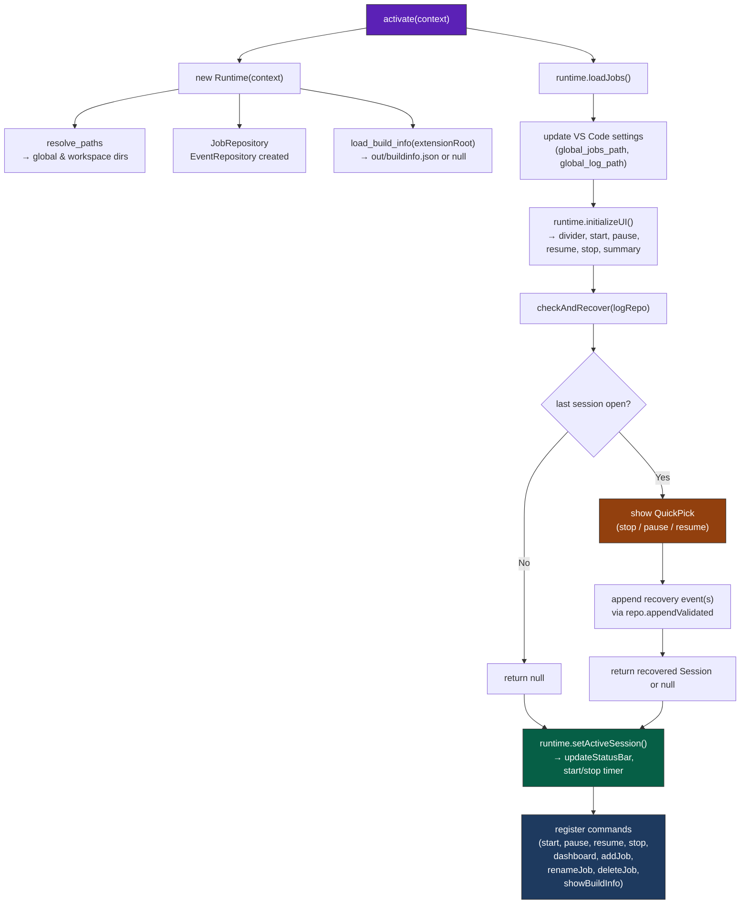
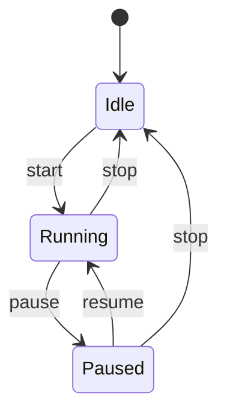
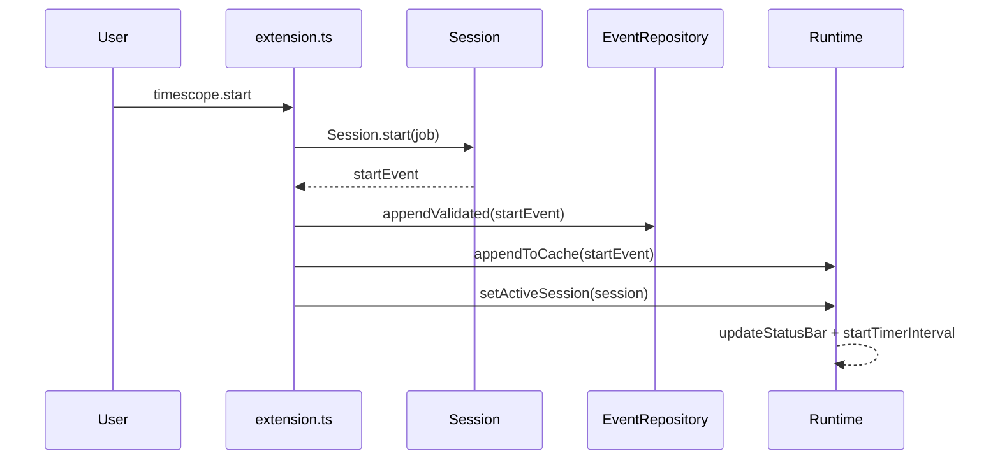
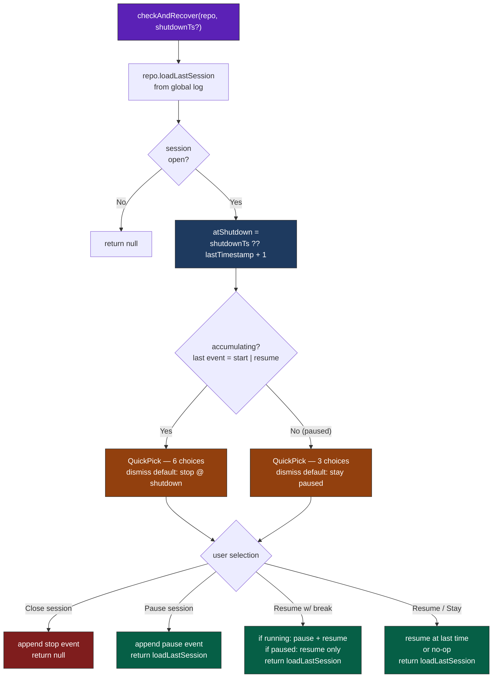
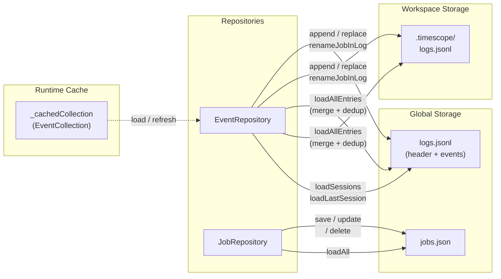
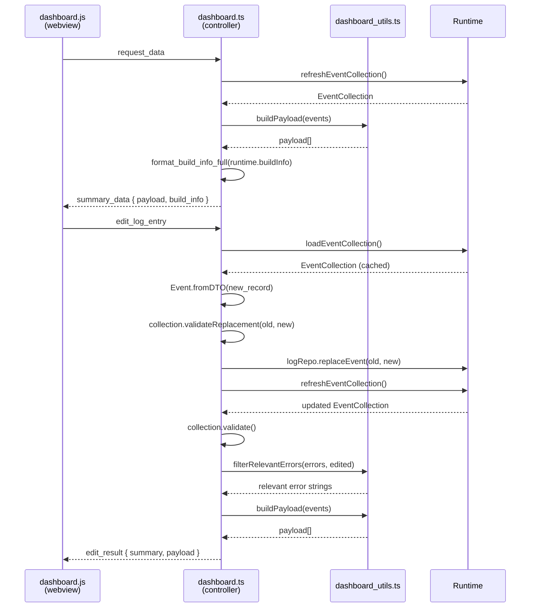
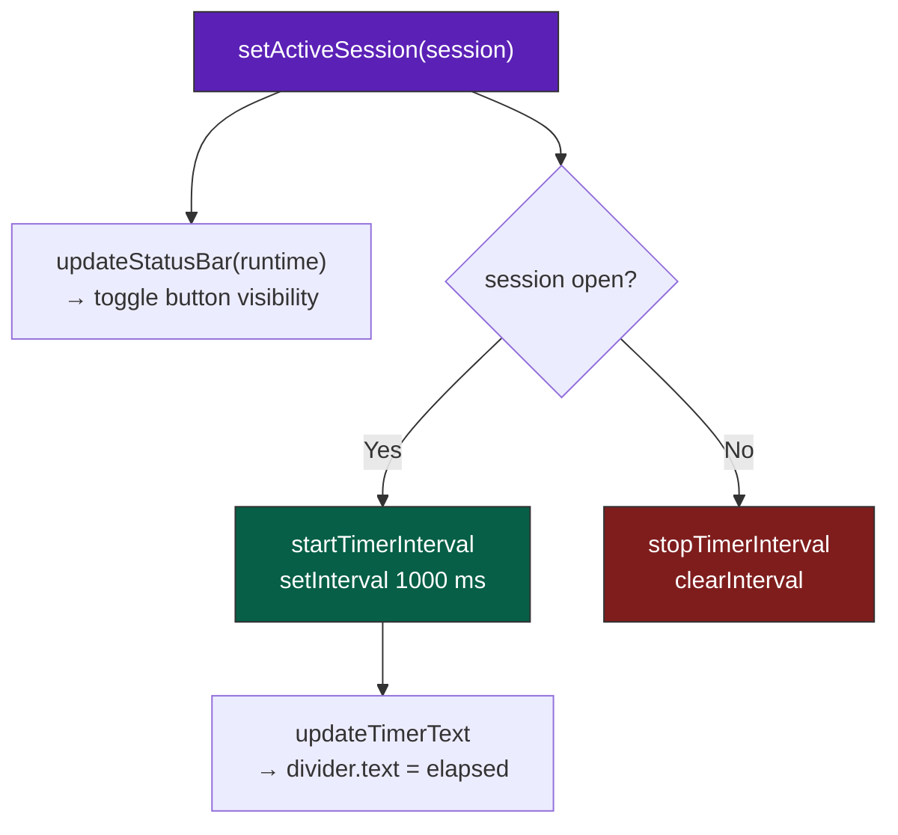

# TimeScope — Architecture & Processes

> Runtime processes, state machines, and data flow for the TimeScope VS Code extension.
> For build/release workflow see [DEVELOPMENT.md](../DEVELOPMENT.md).
> For user-facing overview see [README.md](../README.md).

---

## 1. Activation & Startup

**Key points:**
- `Runtime` is the single owner of paths, repositories, cached `EventCollection`, active `Session`, timer interval, and UI items.
- `checkAndRecover` reads the last session from the global log via `EventRepository.loadLastSession`. If the session is open (last event is not `stop`), the user is prompted. Recovery events flow through the same `appendValidated` path as normal commands.
- No background timer starts unless a session is active after recovery.

---

## 2. Session State Machine

State is tracked by the `Session` domain object (`src/core/session.ts`):

| State | `session.isOpen` | `session.isRunning` | `session.isPaused` |
| :--- | :--- | :--- | :--- |
| Idle | `false` | — | — |
| Running | `true` | `true` | `false` |
| Paused | `true` | `false` | `true` |

`Runtime.setActiveSession(session)` drives all side-effects: `updateStatusBar` toggles button visibility, and `startTimerInterval` / `stopTimerInterval` manage the 1-second refresh.

---

## 3. Command Flow

All four session commands (start, pause, resume, stop) follow the same pattern:
1. Mutate the in-memory `Session` (produces an `Event`).
2. Persist via `EventRepository.appendValidated` (writes to global log + optional workspace mirror, with dedup check).
3. Push the event into `Runtime`'s cached `EventCollection` (avoids a full file re-parse).
4. Call `setActiveSession` to sync UI and timer.

**Stop** additionally prompts for an optional task description.

---

## 4. Recovery Flow

### Shutdown Timestamp Resolution

The extension tracks when VS Code was last alive via two `globalState` keys:

| Key | Writer | Frequency |
| :--- | :--- | :--- |
| `timescope.lastSeen` | heartbeat `setInterval` | every 30 s + once on activation |
| `timescope.lastShutdown` | `deactivate()` | once on graceful shutdown |

On activation, recovery computes `shutdownTs = max(lastSeen, lastShutdown)`. This gives exact timing for graceful shutdowns and ±30 s accuracy for crashes/kills. When neither key exists (first run), the fallback is `lastTimestamp + 1`.

### Selection → Events

| Selection | Timestamp used | Events appended | Return value |
| :--- | :--- | :--- | :--- |
| Close @ shutdown | `atShutdown` | `stop` | `null` |
| Close @ now | `Date.now()` | `stop` | `null` |
| Pause @ shutdown | `atShutdown` | `pause` | recovered `Session` |
| Pause @ now | `Date.now()` | `pause` | recovered `Session` |
| Resume with break | `atShutdown` (pause) + `Date.now()` (resume) | `pause` + `resume` (running) or `resume` only (paused) | recovered `Session` |
| Resume no break | `lastTimestamp` | `resume` (if paused) | recovered `Session` |
| Stay paused | — | none | recovered `Session` |

- All timestamps pass through `ensureAfter(lastTimestamp, requested)` to guarantee monotonic ordering.
- If the user dismisses the QuickPick, the default is: **stop @ shutdown** (if accumulating) or **stay paused** (if paused).

---

## 5. Domain Model

```mermaid
classDiagram
    class Event {
        -_id : string
        -_type : EventType
        -_job : Job
        -_timestamp : number
        -_task : string
        -_time_seed : number
        -_global_line_index : number
        -_workspace_line_index : number
        +create(job, type, ts, task)$ Event
        +fromDTO(dto)$ Event
        +fromJSONL(line)$ Event
        +generate_record_id()$ string
        +toDTO() EventDTO
        +toJSONL() string
        +withJob(job) Event
        +withTimestamp(ts) Event
        +withTask(task) Event
        +isStart() boolean
        +isStop() boolean
        +isPause() boolean
        +isResume() boolean
        +isTerminal() boolean
        +isTransitionAllowed(next) boolean
        +validateTransition(next) ValidationError
        +durationUntil(next) number
        +equals(other) boolean
    }
    class EventCollection {
        -_events : Event[]
        +fromArray(events)$ EventCollection
        +fromLines(lines)$ EventCollection
        +parse_lines(lines)$ EventCollection
        +toLines() string[]
        +serialize() string
        +filterByJob(job) EventCollection
        +sorted() Event[]
        +add(event) void
        +firstEvent() Event
        +lastEvent() Event
        +find(predicate) Event
        +toEvents() Event[]
        +replaceEvent(old, nw) EventCollection
        +withUpdatedJob(job) EventCollection
        +validateReplacement(old, nw) ValidationError[]
        +validateReplacements(pairs) ValidationError[]
        +retimeEvent(event, ts) EventCollection
        +updateEvent(old, nw) EventCollection
        +rewrite(globalPath, wsPath) void
        +validate() ValidationError[]
        +currentState() string
    }
    class Job {
        -_id : string
        -_title : string
        -_seed : string
        -_archived : boolean
        -_createdAt : number
        -_lastModifiedAt : number
        -_partial : boolean
        +create(props)$ Job
        +fromEventFields(id, title)$ Job
        +rename(newTitle) Job
        +archive() Job
        +unarchive() Job
        +toRecord() JobRecord
        +equals(other) boolean
    }
    class JobCollection {
        -_jobs : Job[]
        +fromArray(jobs)$ JobCollection
        +size() number
        +isEmpty() boolean
        +findById(id) Job
        +hasId(id) boolean
        +add(job) JobCollection
        +remove(id) JobCollection
        +update(job) JobCollection
        +rename(id, title) JobCollection
        +filterArchived() JobCollection
        +filterActive() JobCollection
    }
    class Session {
        -_job : Job
        -_events : EventCollection
        +fromEvents(events)$ Session
        +fromCollection(col)$ Session
        +isOpen : boolean
        +isRunning : boolean
        +isPaused : boolean
        +isStopped : boolean
        +start(ts) Event
        +pause(ts) Event
        +resume(ts) Event
        +stop(task, ts) Event
        +appendEvent(event) void
        +elapsed() number
        +totalElapsed() number
        +equals(other) boolean
        +toEventCollection() EventCollection
    }
    class Runtime {
        +paths : TimeScopePaths
        +jobs : JobCollection
        +jobRepo : JobRepository
        +logRepo : EventRepository
        +activeSession : Session
        +timerInterval : Timeout
        +ui : StatusBarItems
        +loadEventCollection() EventCollection
        +refreshEventCollection() EventCollection
        +invalidateEventCollection() void
        +appendToCache(event) void
        +renameJob(job, title) void
        +initializeUI() void
        +loadJobs() void
        +setActiveSession(s) void
    }

    Runtime --> Session
    Runtime --> JobCollection
    Runtime --> "1" EventCollection : cached
    Runtime --> JobRepository
    Runtime --> EventRepository
    Session --> Job
    Session --> EventCollection
    EventCollection --> "*" Event
    JobCollection --> "*" Job
    Event --> Job
```

All domain objects are **immutable** (mutations return new instances). `Runtime` is the only mutable coordinator. `Job._partial` marks instances reconstructed from event fields only (via `fromEventFields`) — they lack full metadata and should not be persisted to `jobs.json`.

See [Record Format Spec](record_format_spec.md) for the on-disk `EventDTO` / `JobDTO` shapes and [Record ID Spec](record_id_spec.md) for deterministic ID derivation.

---

## 6. File I/O

| Operation | Reads | Writes |
| :--- | :--- | :--- |
| Session command (start/pause/resume/stop) | — | global log, workspace log |
| Recovery | global log | global log, workspace log |
| Dashboard `request_data` | global + workspace (merged) | — |
| Dashboard edit | global + workspace (merged) | global log, workspace log |
| Rename job | global log, workspace log | global log, workspace log, `jobs.json` |
| Add/delete job | — | `jobs.json` |

- `EventRepository.loadAllEntries()` merges both logs and de-duplicates by event ID, attaching `global_line_index` and `workspace_line_index` to each `Event`.
- `Runtime` caches the `EventCollection`; `appendToCache` avoids a full re-parse after each write. `invalidateEventCollection` clears the cache after bulk rewrites (e.g. job rename).
- `JobRepository` has **no** workspace mirror — jobs are stored only in global `jobs.json`.

---

## 7. Dashboard

- `dashboard_utils.ts` exports two pure functions: `buildPayload()` (timestamp-descending DTO array) and `filterRelevantErrors()` (scopes validation errors to the edited events).
- `build_info.ts` exports `load_build_info()` (reads `out/buildinfo.json`, `null` if missing/malformed) and formatters `format_status_bar_suffix()` / `format_build_info_full()` (the latter composed from the former). `Runtime` loads it once at construction; the status-bar tooltip, dashboard footer, and the Show Build Info command all render it, with a "no build info" fallback.
- The controller routes all data access through `Runtime` — never directly to `EventRepository`.
- `edit_log_entries` (batch edit) follows the same pattern per-edit, with per-item error accumulation.
- The dashboard panel uses `retainContextWhenHidden` so it stays alive when the tab loses focus.
- The controller does **not** push data proactively — all updates are triggered by webview messages.

---

## 8. Timer & Status Bar

- `updateTimerText` reads `session.elapsed()` (handles paused intervals) and formats as `Xh Ym`.
- The timer is managed by `Runtime`; `timer.ts` contains only pure helper functions.

---

## Related Documentation

| Document | Description |
| :--- | :--- |
| [README.md](../README.md) | User-facing overview, commands, settings |
| [DEVELOPMENT.md](../DEVELOPMENT.md) | Build, test, feature & release workflow |
| [record_format_spec.md](record_format_spec.md) | On-disk format for `jobs.json` and `logs.jsonl` |
| [record_id_spec.md](record_id_spec.md) | Deterministic record ID derivation (FNV-1a, base-36) |
| [coding_standards.md](../coding_standards.md) | Project coding conventions |
