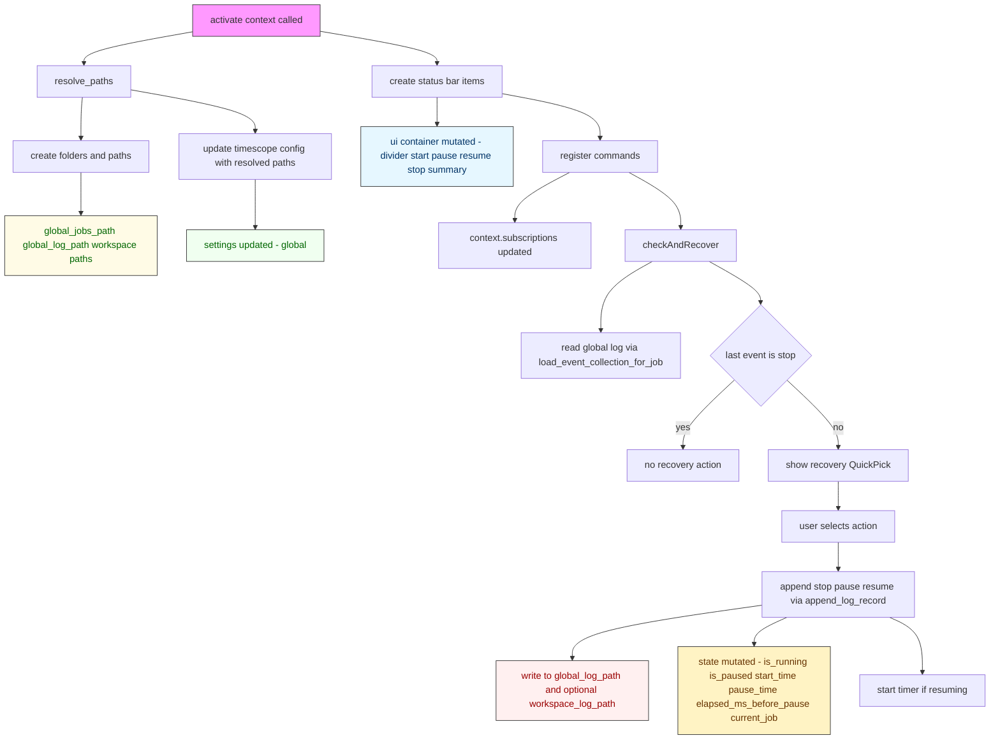
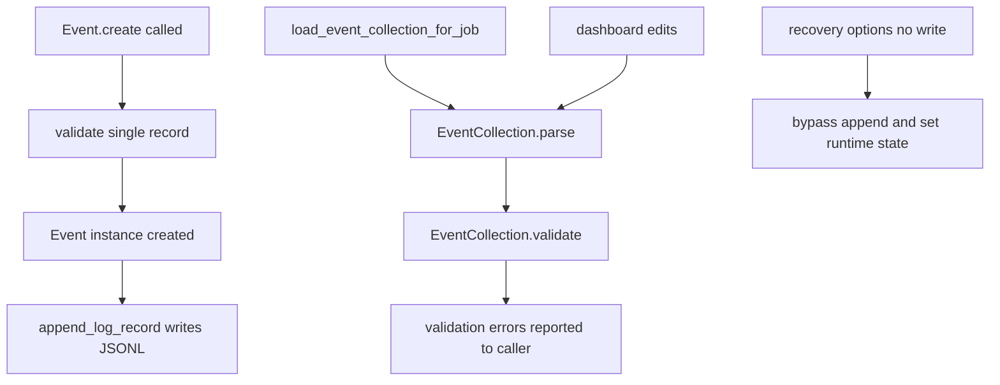
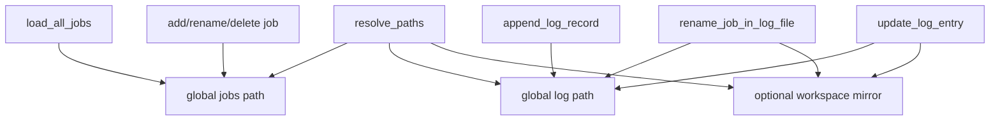
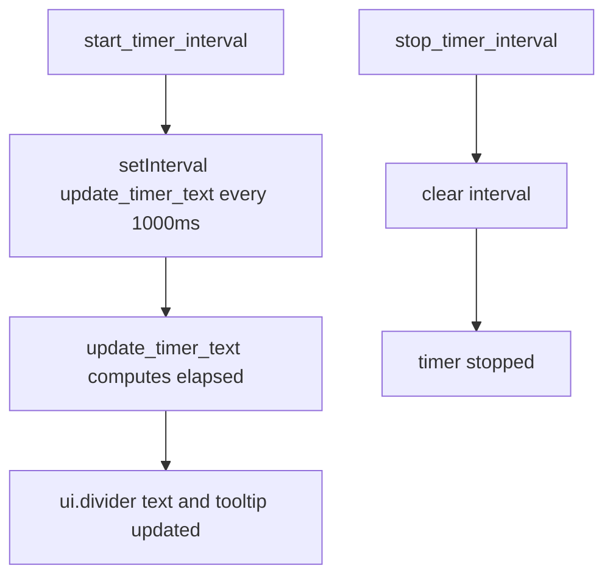
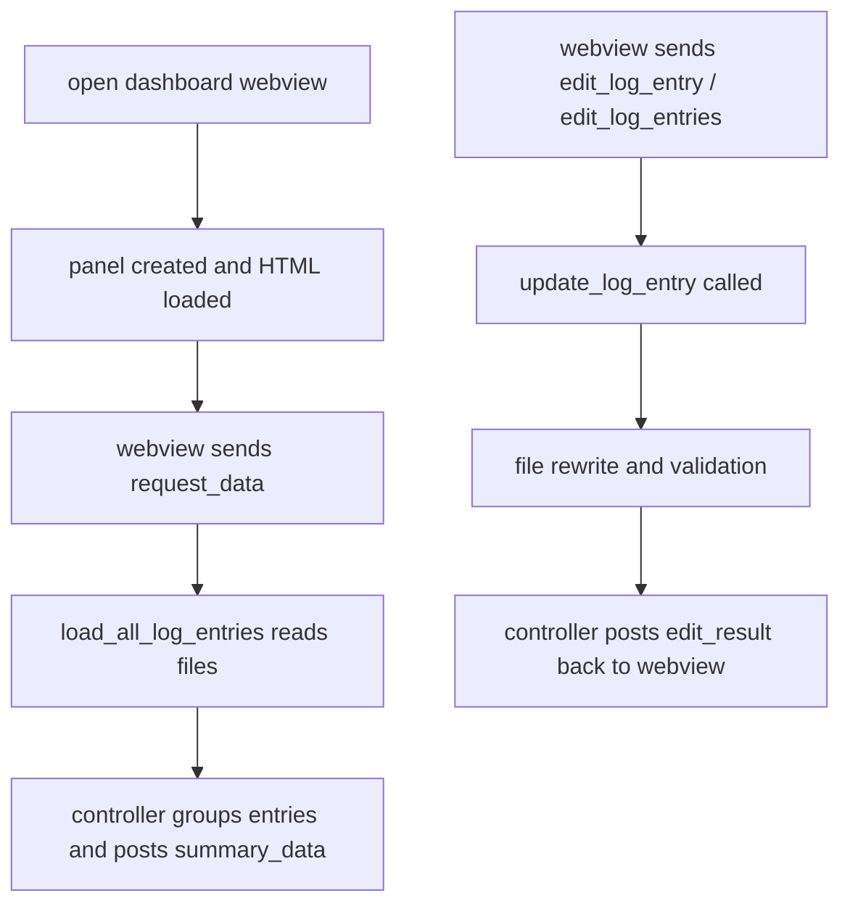
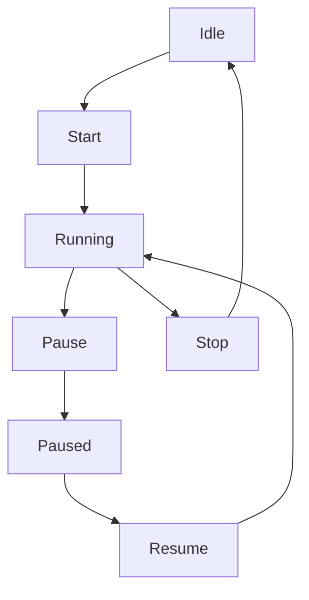
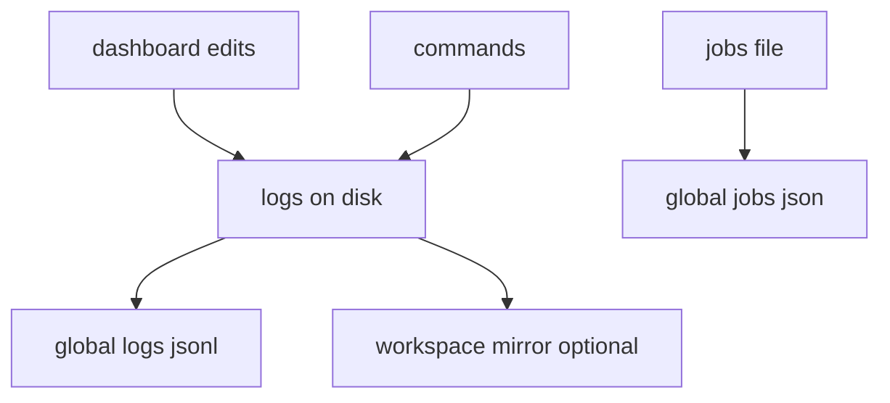

# TimeScope — Process Catalog

This document describes every runtime process in the TimeScope VS Code extension and when each runs.

**Notes:** the extension implementation lives mostly under `src/` and key modules referenced below are:
- `src/extension.ts` — activation and command registration
- `src/core/*` — paths, jobs, logs, event domain, runtime state, timer, recovery
- `src/dashboard/*` — dashboard webview controller

---

## 1. STARTUP PROCESSES

---

- Activation entry: `activate(context)` in `src/extension.ts` runs when the extension activates (VS Code loads the extension according to activation events in `package.json`).

- What runs when the extension activates:
  - `resolve_paths(context)` in `src/core/paths.ts` — computes canonical global storage files and optional workspace mirror paths; creates directories if missing.
  - Configuration update: writes resolved `global_jobs_path` and `global_log_path` back into the `timescope` configuration (global scope) so settings UI reflects canonical paths.
  - Status bar UI construction: creates several `StatusBarItem`s and registers them in `context.subscriptions`:
    - divider (label), `start_button`, `pause_button`, `resume_button`, `stop_button`, `summary_button`.
    - Only `divider`, `start_button`, and `summary_button` are shown immediately; the rest are hidden until state changes.
  - `checkAndRecover(paths)` in `src/core/recovery.ts` — run once during activation to inspect the global log and offer recovery actions if an open session is detected.
  - Command registrations (see Command Processes below) — all commands are registered and pushed to `context.subscriptions`.

- Initialized runtime state:
  - `src/core/state.ts` exports `state` with defaults: `is_running=false`, `is_paused=false`, `start_time=null`, `pause_time=null`, `elapsed_ms_before_pause=0`, `current_job=null`, `timer_interval=null`.
  - `ui` container holds StatusBarItem references (populated in activation).

- Files read during startup:
  - `resolve_paths` may create directories; it does not read job/log files at that point.
  - `checkAndRecover` loads the global log via `load_event_collection_for_job(paths)` which reads `global_log_path` (and ignores workspace mirror when building the canonical job-level collection).

- Recovery logic run on activation (`checkAndRecover`):
  - Loads event collection from the global log and inspects the last event.
  - If the last event is not `stop`, prompts the user with choices (stop now/stop at shutdown, pause now/stay paused, resume with/without break).
  - Depending on the user's choice, it may append `stop`, `pause`, or `resume` events to the log (using `append_log_record`), update the runtime `state`, and call `start_timer_interval()`/`stop_timer_interval()` and `update_status_bar()` as appropriate.
  - There is a deliberate recovery option that bypasses writing events (`resume with no break`) which initializes runtime state without appending logs.

- UI elements created at activation:
  - All status bar items listed above; `summary_button` is wired to the dashboard command.
  - No webview/dashboard is created automatically on activation.

- Background timers started on activation:
  - None by default. The periodic timer (`setInterval` used for updating the timer text) is only started when a session resumes/runs (via `start_timer_interval()`), either through user `start` or via recovery choices that resume the session.

*** End Patch

---

## 3. DOMAIN PROCESSES

- Primary domain types:
  - `Event` (`src/core/event.ts`) — immutable object representing a single record. Creation via `Event.create(dto)` performs strict validation: valid event type, job (non-empty string), numeric timestamp, optional task string.
  - `EventCollection` — an in-memory collection of `Event` objects. Provides parsing (`parse_lines`), sorting, filtering by job, rename/replace/retime operations, and validation of whole sequences (`validate`).

- When events are created:
  - User actions: `start`, `pause`, `resume`, `stop` commands create `Event` objects via `Event.create` before they are appended to the log.
  - Recovery: `checkAndRecover` may create and append `stop`, `pause`, or `resume` events depending on user's recovery choice.
  - Dashboard edits: user-initiated edits from the dashboard create `Event` instances and use `update_log_entry` to rewrite log files.

- When collections are loaded:
  - `load_event_collection_for_job(paths, job?)` reads lines from the global log and returns an `EventCollection` parsed from those lines. This is used by recovery, validation and by some tests.
  - `load_all_logs(paths)` and `load_all_log_entries(paths)` read global and optional workspace mirror files to return either an `EventCollection` or raw entries with sources and line indices (dashboard uses the latter).

- When validation occurs:
  - `Event.create` performs single-record validation.
  - `EventCollection.validate` checks sequence-level constraints (first record must be `start`, transitions must be valid, timestamps must increase, etc.). It is used after log updates (e.g., `update_log_entry` returns validation errors) and in tests.
  - `update_log_entry` calls `load_event_collection_for_job(...).validate({ startFromLatest: true })` and returns any validation errors to the caller (dashboard reports errors back to the webview).

- When domain logic is bypassed or special-cased:
  - Recovery option "Resume with no break" can initialize runtime state without appending any `resume` event — the runtime is set to running but the log is not changed.
  - Dashboard code tries to be permissive when receiving edits: it attempts `Event.create(new_record)` and if that throws, falls back to treating `new_record` as an `Event` instance.
  - The extension contains duplicated `append_log_record` calls in `pause`, `resume`, and `stop` that appear to be accidental duplicates — they may cause runtime errors or rely on dedup checks. This effectively bypasses the intended single-domain-object path for appending events and is likely a bug.

---

## 4. FILE I/O PROCESSES

Paths (resolved by `resolve_paths`):
- Global storage directory: either the configured `timescope.global_storage_dir` or `context.globalStorageUri.fsPath`.
- `global_jobs_path` → `<globalDir>/jobs.json` (canonical list of job names).
- `global_log_path`  → `<globalDir>/logs.jsonl` (canonical event log, JSONL with a header).
- Workspace mirror (if workspace open): `<workspace>/.timescope/jobs.json` and `<workspace>/.timescope/logs.jsonl` (optional mirrors).

Places the extension reads files:
- `resolve_paths` — ensures directories exist (creates them) but does not parse job/log contents.
- `load_jobs_from_file` in `src/core/jobs.ts` — reads `jobs.json` (global) whenever `load_all_jobs` is invoked (start quick pick, rename/delete flows, etc.).
- `load_all_log_entries` and `load_event_collection_for_job` in `src/core/logs.ts` — read `global_log_path` (and `workspace_log_path`) to parse events for dashboard, recovery, validation, and edits.
- `handle_dashboard` reads webview HTML/JS/CSS assets from `out/dashboard/webview/` using `fs.promises.readFile` when opening the summary dashboard.

Places the extension writes files:
- `append_log_record(paths, event)` — appends a single JSONL line to `global_log_path`, creating the file with a header (`_format_version`) if it does not exist. If a workspace mirror exists, it writes/append to that file too. Called for `start`, `pause`, `resume`, `stop`, and some recovery paths.
- `save_jobs_to_file` — writes `jobs.json` (global) on `add_job`, `rename_job`, `delete_job`.
- `rename_job_in_log_file(paths, old, new)` — reads the log file(s), rewrites them with job name substitutions and writes the entire file back (preserving header), used on `rename_job`.
- `update_log_entry(paths, old_raw_line, new_record)` — reads file(s), replaces matching event lines, and rewrites the file(s); returns flags indicating replacements and any validation errors.

When it happens and why (summary):
- Reading jobs.json: whenever UI needs the job list (start quick pick, rename/delete flows).
- Writing jobs.json: on add/rename/delete to persist the canonical job list.
- Reading logs.jsonl: on activation recovery check, on dashboard data requests, on validation after edits, and by tests.
- Appending to logs.jsonl: whenever a runtime session action occurs (`start`, `pause`, `resume`, `stop`) or when recovery or dashboard-edit operations add/resume/stop events.
- Rewriting logs.jsonl: on rename operations (job name mass-rewrite) and on updates coming from the dashboard edit flows.

---

## 5. BACKGROUND PROCESSES

- Timer interval:
  - Implementation: `start_timer_interval()` sets `state.timer_interval = setInterval(update_timer_text, 1000)`.
  - Interval period: 1000 ms (1 second).

- What it updates:
  - `update_timer_text()` computes elapsed time by combining `state.elapsed_ms_before_pause` and the delta between `Date.now()` and `state.start_time` (when running). It then updates `ui.divider.text` and `ui.divider.tooltip` to show either running or paused state and the formatted duration (hours/minutes).

- When it starts:
  - Called from `start_job()` (user `start`) and from recovery paths that resume a session. `start_timer_interval` ensures any previous timer is cleared and sets a fresh interval.

- When it stops:
  - Called by `stop_timer_interval()` invoked on `stop` command, on `deactivate()`, and when recovery chooses to close the session.

- State dependency:
  - The timer display depends on `state.is_running`, `state.is_paused`, `state.start_time`, `state.pause_time`, and `state.elapsed_ms_before_pause`. The interval itself runs regardless of paused/running status once started (the update function adapts to paused state), except when explicitly cleared.

---

## 6. DASHBOARD PROCESSES

- When the dashboard loads:
  - Triggered by `timescope.dashboard` command. `handle_dashboard(context)` creates a `WebviewPanel`, loads `index.html` from `out/dashboard/webview`, injects URIs for the webview bundle and sets `panel.webview.html`.
  - `retainContextWhenHidden: true` means the webview maintains state while hidden.

- Data it reads:
  - The extension listens for `request_data` messages from the webview; when received, it calls `load_all_log_entries(paths)` which reads `global_log_path` and optional `workspace_log_path` and returns parsed records with raw lines and source info. The controller groups identical events and sends a `summary_data` payload back to the webview.

- How it updates:
  - The extension responds only to messages from the webview; it does not independently push updates. When the webview asks for data or submits edits, the extension reads/writes the log files and posts updated payloads back to the webview.
  - Edit flows (`edit_log_entry` and `edit_log_entries`) call `update_log_entry` which replaces lines in files and returns validation errors; the controller then posts `edit_result` with both a summary and updated payload.

- Reactive vs static:
  - From the extension's perspective the dashboard is reactive to webview messages: it responds to explicit requests and actions. It is not automatically reactive to external log changes unless the webview re-requests data. The `retainContextWhenHidden` option keeps the panel alive, but updates require an explicit message round-trip.

---

## 7. STATE MACHINE PROCESSES

- UI/runtime state machine (coarse):
  - States represented across `state.is_running` (boolean) and `state.is_paused` (boolean). Conceptually the UI has three states:
    - idle: `is_running=false`, `is_paused=false`
    - running/accumulating: `is_running=true`, `is_paused=false`
    - paused: `is_running=true`, `is_paused=true`

- How transitions occur:
  - idle -> running: `start` command sets `is_running=true`, `is_paused=false`, sets `start_time` and appends `start` event.
  - running -> paused: `pause` sets `is_paused=true`, sets `pause_time` and appends `pause` event.
  - paused -> running: `resume` computes paused duration, updates `elapsed_ms_before_pause`, resets `start_time`, clears `pause_time`, appends `resume` event.
  - running/paused -> idle: `stop` appends `stop` event, calls `stop_timer_interval()` and `reset_state_after_stop()` (clears job and timing state).

- Triggers for transitions: status bar buttons, commands, or recovery flows that set state programmatically.

- Duplication or inconsistency points:
  - Duplicate append calls in `pause`, `resume`, and `stop` — the code currently calls `append_log_record` twice (once with a plain object and once with `Event.create`). This duplicates log intent and is inconsistent with the rest of the code which uses typed `Event` objects. The duplication may result in runtime errors or rely on dedup checks; it is a code smell and should be resolved.
  - `resume` does not explicitly call `start_timer_interval()` but relies on an existing interval created earlier; if the interval had been cleared for any reason, `resume` would not restart it.
  - Recovery contains legitimate bypasses (e.g. resume without writing events) which intentionally diverge the state machine from the log; this is a designed behavior but should be noted as a divergence between runtime state and persisted log.

---

## 8. OUTPUT FORMAT

- This file is the structured, human-readable description of every TimeScope process and when each runs. It is intentionally narrative and enumerates triggers, file I/O, domain usage, validation points, UI updates and timers.

---

## IMPLEMENTATION NOTES & RECOMMENDATIONS

---

- The code base uses clear domain types (`Event`, `EventCollection`) and explicit validation on single events and collections. The dashboard exposes an edit surface that reuses these validation functions.
- Two potential problems to address:
  1. Duplicate `append_log_record` calls in `pause`, `resume`, and `stop` in `src/extension.ts` — this is likely a bug and should be removed so only typed `Event` objects are appended once.
  2. `resume` relies on the timer interval existing; consider calling `start_timer_interval()` on resume to make the behavior robust.

---

Document produced from a code scan of `src/` modules (extension, core, dashboard) and the control flows implemented in those files.
